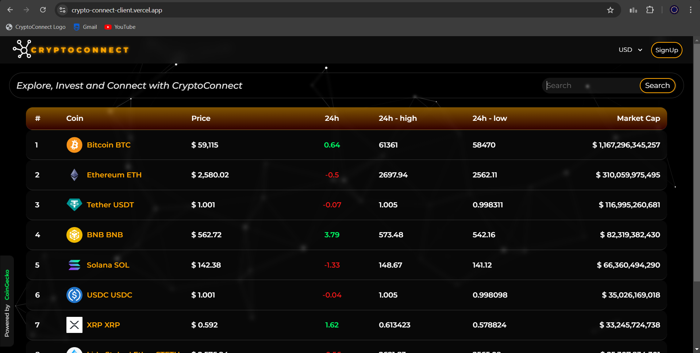
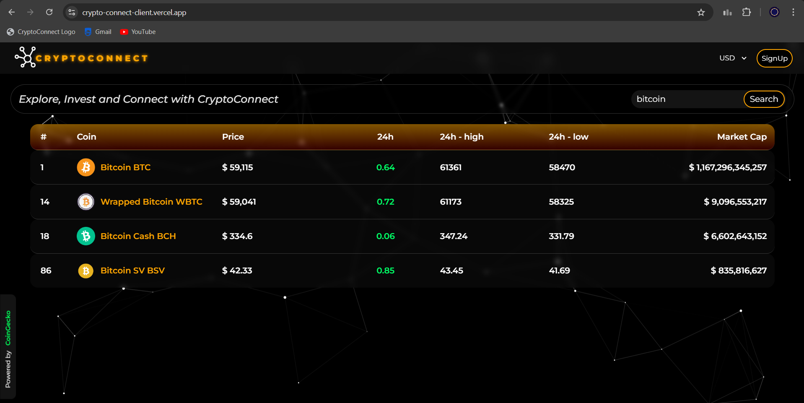
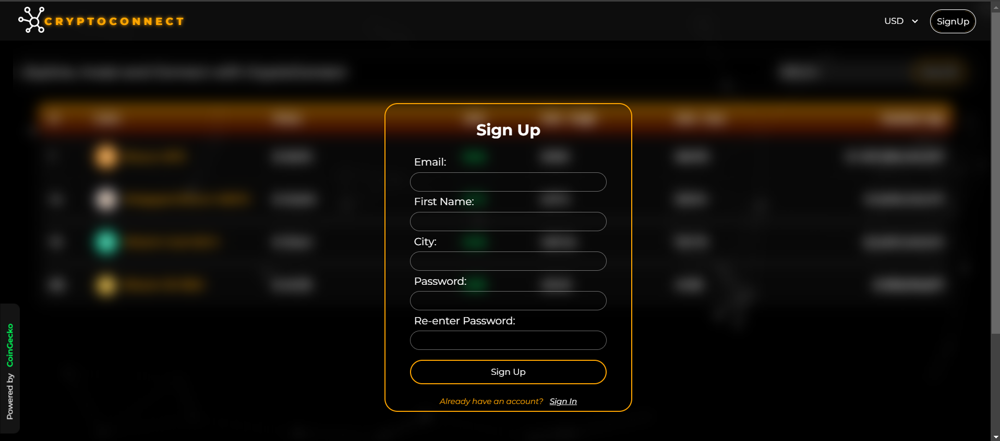
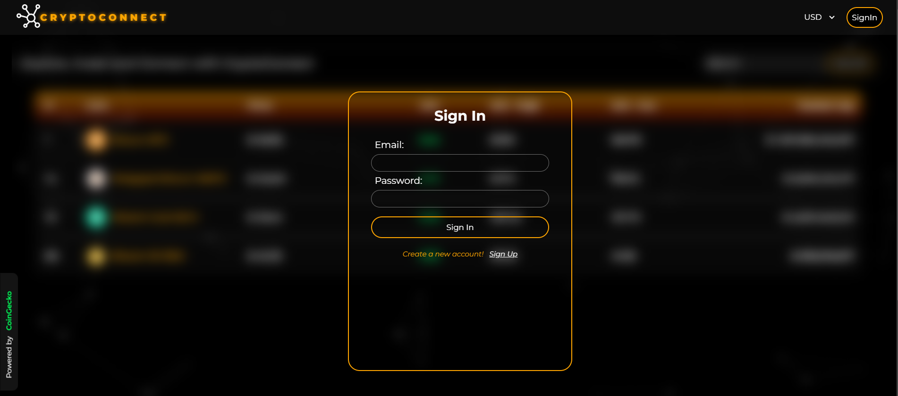
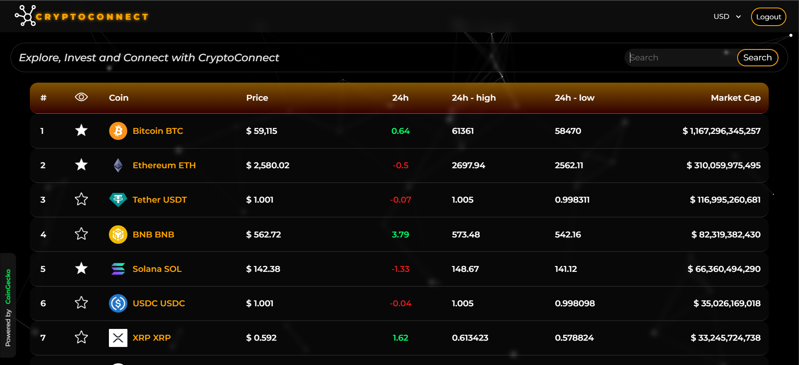

# CryptoConnect

Stay on top of the cryptocurrency market with CryptoConnect! This single page application provides real-time market prices for various cryptocurrencies, allowing you to make informed investment decisions. Plus, create a personalized watchlist by logging in and adding your favorite coins to track their performance. Easily stay up-to-date with the latest market trends and make data-driven decisions with CryptoTracker.

## Clone and Navigate to the Project Directory

## Prerequisites

Make sure you have the following installed on your system:

    - Node.js

## Set up the Frontend

1. Navigate to the Frontend Directory - cd Frontend

2. Install Dependencies - npm install

3. Set up CoinGecko API Key
   - Sign up on the CoinGecko website and obtain an API key. Create a new file named .env in the frontend directory and add the following line:
     - COIN_API_KEY = YOUR_API_KEY_HERE
     - Replace YOUR_API_KEY_HERE with your actual API key.

## Set up the Backend

1. Navigate to the Backend Directory - cd Backend

2. Install Dependencies - npm install

3. Set up MongoDB Connection URL
   - Create a new file named .env in the backend directory and add the following line:
     - DB_URL = you_mongo_db_connection_url
     - Replace your-mongodb-url with your actual MongoDB connection details.

## Run the Project

1. Run the Backend

   - navigate to backend folder
     - npm run start

2. Run the Frontend
   - navigate to frontend folder
     - npm run dev

Open your web browser and navigate to http://localhost:3000 to access the frontend application.

## Troubleshooting

- If you encounter any issues, check the console logs for errors. Make sure you have replaced the placeholders with your actual API key and MongoDB connection details.

## Note

- This project uses a .env file to store environment variables. Make sure to add the .env file to your .gitignore file to avoid committing sensitive information to your repository.

Landing Page

Search functionality

Sign up

Sign in

Add coins to watchlist

## Visit the site at
https://crypto-connect-client.vercel.app/
For best experience please use Google Chrome!
